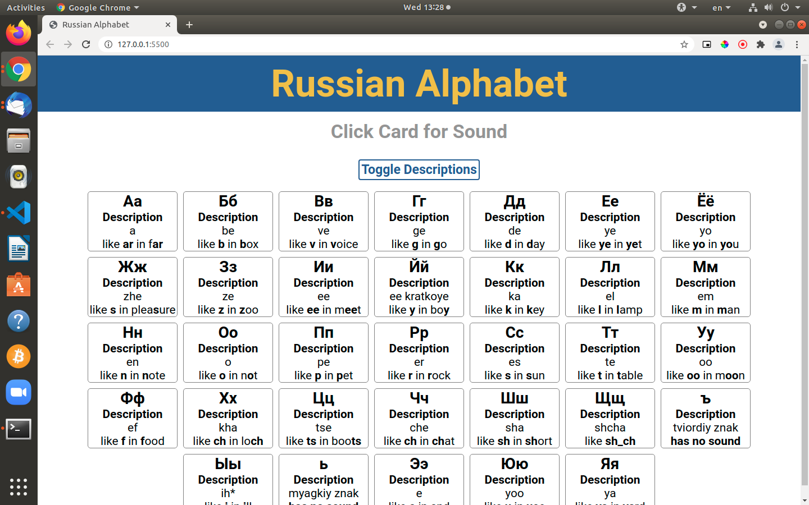

# Russian Alphabet

> This project is a Russian Alphabet app built using JavaScript. This app features two main functionalities. The functionality to toggle the description of each card & the functionality to have audio playback once you click a card.

### Russian Alphabet Screenshot:



# Live Preview

[View Project](https://rawcdn.githack.com/jacobrees/Russian-Alphabet/7f54659b85cc93bf498a5ad479fcc14221f8b15a/index.html)

# Getting Started

To get a local copy of the repository please run the following commands in your terminal:

```
$ cd <folder>
```

```
$ git clone git@github.com:jacobrees/Russian-Alphabet.git
```

To launch an instance of this app. Inside of your terminal you will need to navigate into the repository you have just cloned. You will do this by using `cd` inside of your terminal. 

Once you are inside of this folder run the command `google-chrome index.html` and this will open the project in Google Chrome (substitute google-chrome for your prefered web browser if you wish to open in a different browser). 

Below shows the following commands you will need to run to achieve this:

```
$ cd Russian-Alphabet
```

```
$ google-chrome index.html
```

## Built With

- HTML
- SCSS
- JavaScript

## Authors

👤 **Jacob Rees**

- Github: [@jacobrees](https://github.com/jacobrees)
- Linkedin: [jacob-rees-a6507b1a6](https://www.linkedin.com/in/jacob-rees-a6507b1a6/)


## 🤝 Contributing

Contributions, issues and feature requests are welcome!

## Show your support

Give a ⭐️ if you like this project!

## Acknowledgments

- Audio samples and descriptions taken from Russian For Everyone
- Code linters used within this project have been developed by Microverse
